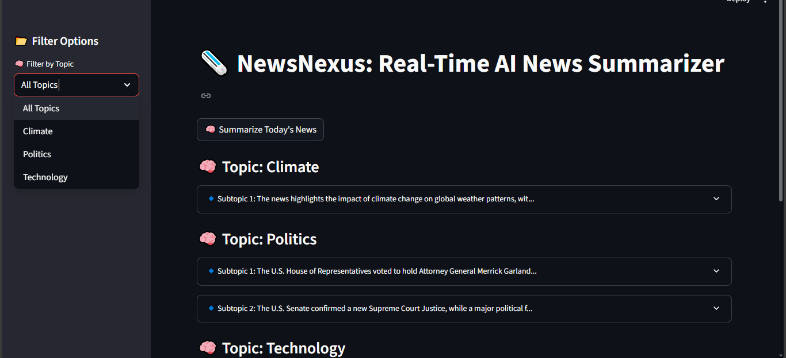
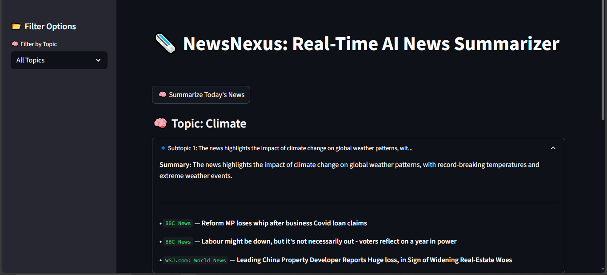

# 📄 NewsNexus — Real-Time AI-Powered News Summarizer

NewsNexus is a real-time news summarization app that scrapes live RSS news, clusters related stories, and uses LLMs to generate concise summaries. All of this is presented in a clean, interactive Streamlit dashboard with filtering options.

🔗 **Live Demo**: [Click here to try the app on Streamlit](https://newsnexussummarizer.streamlit.app/)

---

## 🚀 Features

- 🔄 **Real-time RSS News Scraping**  
  Fetches fresh news headlines and summaries from major news sources.

- 🧠 **AI-Powered News Clustering & Summarization**  
  Clusters related articles using ML and summarizes them using Groq-powered LLMs (e.g., Mixtral, DeepSeek).

- 🗂️ **Topic-wise Subtopic Grouping**  
  Summarized clusters are grouped under categorized topics with subtopics.

- 🖥️ **Interactive Streamlit UI**  
  - Sidebar for topic filtering  
  - Expander-based summaries for easy browsing  
  - One-click summarization for daily news

---

## 🛠️ Tech Stack

- **Python**
- **Streamlit** – Interactive frontend
- **LangChain** – LLM orchestration
- **Groq** – Fast inference using models like Mixtral or DeepSeek
- **Scikit-learn** – News clustering
- **Feedparser** – RSS scraping
- **Dotenv** – API key management

---

## ⚙️ Setup Instructions

1. **Clone the repository**  
   ```bash
   git clone https://github.com/your-username/newsnexus.git
   cd newsnexus
   
2. **Install dependencies**  
   ```bash
   pip install -r requirements.txt
   
3. **Set up your `.env` file**
   ```bash
   GROQ_API_KEY=your_groq_api_key_here
4. **Run the Streamlit App**
   ```bash
   streamlit run app.py

--- 

## 🧾 Usage Instructions

1. Click **“🧠 Summarize Today's News”** on the home screen.
2. Wait while the app:
   - Fetches news via RSS
   - Clusters similar stories
   - Summarizes them using LLMs
3. Use the **sidebar** to filter summaries by topic.
4. **Expand summaries** for subtopics and article-level details.
5. Use the **Download** button to export the summary as a JSON file.

---

## 🐞 Known Issues

- **News Misclassification:**  
  Some articles may be assigned to slightly inaccurate topics due to model limitations. I am actively exploring improvements.

---

## 🌟 Future Improvements

- ✅ Daily schedule-based summarization (via cron/Streamlit Cloud)
- 📊 Sentiment analysis alongside summaries
- 🔍 Keyword/tag-based filtering
- 📱 Mobile-responsive layout
- 🧩 Multi-model support and comparison (Groq vs OpenAI vs Anthropic)

---

## 📸 Screenshots

### 🏠 Home UI with Filtering

| Home UI 1 | Home UI 2 |
|---------------|------------------|
|  |  |


---

## 🙌 Contributing

Contributions, issues, and feature requests are welcome!  
Feel free to fork the repository and submit a pull request.

---
## ⭐ Give us a Star!

If you found this project helpful or interesting, please consider giving it a ⭐ on GitHub.  
It helps me grow and reach more contributors!

